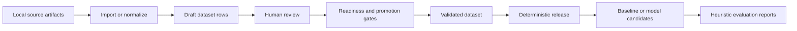

# RTLSpecializer

Evidence-aware, dataset-first tooling for building structured RTL specialist training and evaluation data.

[](https://github.com/ArmmyC/RTLSpecializer/actions/workflows/ci-smoke.yml) [](https://www.python.org/)

[Overview](#overview) · [Quick start](#quick-start) · [Workflow](#workflow) · [Evaluation](#evaluation) · [Documentation](#documentation)

> [!IMPORTANT]
> RTLSpecializer is dataset preparation, review, release, and evaluation tooling. Its heuristic scores and teacher-distillation pilots are not proof of RTL correctness, equivalence, timing, area, activity, or power.

## Overview

RTL specialists need more than syntactically valid code. They need to reason about clock-cycle behavior, reset semantics, state, area, switching activity, evidence quality, and the limits of what a tool result can support.

RTLSpecializer turns those requirements into a reproducible local workflow:

- structured `rtl_task_v0.1` and `rtl_answer_v0.1` schemas;
- provenance-bearing `dataset_v0.1` JSONL rows;
- conservative import, normalization, validation, and review gates;
- deterministic train/validation/test release assembly with manifests, hashes, statistics, and a dataset card;
- offline rule-baseline and candidate-answer evaluation;
- optional local or OpenAI-compatible model runners with resumable, JSON-safe outputs; and
- an experimental teacher-distillation and fine-tuning pilot boundary.

The project is intentionally evidence-aware: missing tool results remain missing, unsupported claims are downgraded, and draft rows never become training-ready automatically.

## What it does

| Area | Capability |
| --- | --- |
| Dataset foundation | Validate row envelopes, task artifacts, answer structure, provenance, review status, and claim levels. |
| Public-data intake | Import locally staged public RTL artifacts into conservative draft rows without downloading, executing, or promoting them. |
| Human review | Prepare review packets, triage edited batches, check readiness, and promote only grounded public rows. |
| Release assembly | Build deterministic train/val/test JSONL releases with split isolation, duplicate checks, rejection records, SHA-256 manifests, and dataset cards. |
| Evaluation | Generate conservative rule baselines and score candidate answers with deterministic structural and evidence-safety heuristics. |
| Model workflows | Run local model candidates, benchmark multiple configurations, or call an explicitly configured OpenAI-compatible endpoint. |
| Fine-tuning boundary | Export canonical pilot data and compare baseline versus fine-tuned outputs without treating the pilot as golden data. |

## Workflow



The core dataset and evaluation tools do not execute RTL, testbenches, shell snippets, or tool-log content embedded in rows. RTL simulation, synthesis, equivalence, and power analysis are outside this repository's core workflow.

## Quick start

### Prerequisites

- Python 3.10 or newer
- Git
- `pytest` for the test suite

The core scripts use the Python standard library. The repository does not currently provide a package installer or dependency lockfile.

### Clone and validate the seed dataset

```bash
git clone https://github.com/ArmmyC/RTLSpecializer.git
cd RTLSpecializer

python scripts/dataset/validate_dataset.py \
  --input data/golden/golden_v0.1.jsonl \
  --strict

python scripts/dataset/inspect_dataset.py \
  --input data/golden/golden_v0.1.jsonl
```

The repository includes a small synthetic golden seed dataset for smoke testing. It is not a substitute for a larger human-reviewed release.

### Run the tests

```bash
python -m pip install "pytest>=8,<9"
python -m pytest tests/dataset tests/eval
```

The CI smoke workflow runs strict seed validation and the dataset/evaluation test suite on pushes to `main` and on pull requests. It does not call models, run EDA tools, simulate or synthesize RTL, train models, or download raw datasets.

## Core workflows

### Validate and split a dataset

Validation is the operational gate for dataset rows. Strict mode treats warnings as failures.

```bash
python scripts/dataset/validate_dataset.py \
  --input data/golden/golden_v0.1.jsonl \
  --strict

python scripts/dataset/split_dataset.py \
  --input data/golden/golden_v0.1.jsonl \
  --output-dir data/processed \
  --seed 7
```

Splitting isolates `design_family` values by default to reduce leakage between train, validation, and test data.

### Import and review local public artifacts

Public-data intake is deliberately local and review-first. Stage source files yourself, import them as drafts, prepare a review packet, then check and promote manually edited rows:

```bash
python scripts/dataset/import_public_dataset.py \
  --adapter manifest \
  --input data/raw_public/example_manifest.jsonl \
  --output data/drafts/public_manifest_draft_v0.1.jsonl \
  --json

python scripts/dataset/prepare_review_packet.py \
  --input data/drafts/public_manifest_draft_v0.1.jsonl \
  --output-dir data/review/public_manifest_batch_001 \
  --json

python scripts/dataset/check_review_batch_readiness.py \
  --selected data/review/public_manifest_batch_001/selected_rows.jsonl \
  --reviewed data/review/public_manifest_batch_001/reviewed_rows.jsonl \
  --output-json data/review/public_manifest_batch_001/readiness_report.json \
  --output-md data/review/public_manifest_batch_001/readiness_report.md \
  --strict \
  --json

python scripts/dataset/promote_reviewed_rows.py \
  --input data/review/public_manifest_batch_001/reviewed_rows.jsonl \
  --output data/processed/public_validated_v0.1.jsonl \
  --report data/reports/public_validated_v0.1_report.json \
  --json
```

Imported rows remain drafts until a reviewer replaces the conservative stub with a grounded answer and the promotion gates pass. See the [public-data review workflow](docs/dataset/review_promotion_workflow.md).

### Prepare a VerilogEval review batch

For VerilogEval-style data, place a locally obtained checkout under an ignored path such as `data/.local_data/verilog-eval-main/`, then prepare a small draft batch:

```bash
python scripts/dataset/prepare_verilog_eval_review_batch.py \
  --input data/.local_data/verilog-eval-main \
  --output-dir data/review/verilog_eval_batch_001 \
  --limit 10 \
  --license "Verify the exact local source license before promotion" \
  --json
```

This command does not download VerilogEval, run tools, call an LLM, or mark rows validated. Continue through human review, readiness checking, and promotion before using the rows in a release.

### Assemble a release

Build an auditable release only from validated or reviewed local inputs:

```bash
python scripts/dataset/build_dataset_release.py \
  --release-name release_v0.1 \
  --input data/golden/golden_v0.1.jsonl \
  --output-dir data/releases \
  --seed 7 \
  --allow-source-overlap \
  --json
```

Each release contains `train.jsonl`, `val.jsonl`, `test.jsonl`, `rejected_rows.jsonl`, `manifest.json`, `stats.json`, `dataset_card.md`, and `all_accepted.unsplit.jsonl`. The manifest records hashes for generated files; the stats file records split, source, task-family, and duplicate/leakage checks.

## Evaluation

### Offline baseline and evaluator

The evaluator consumes dataset rows and candidate-answer JSONL. It does not make model calls and does not prove RTL correctness.

```bash
python scripts/eval/make_baseline_candidates.py \
  --dataset data/releases/release_v0.1/test.jsonl \
  --output data/eval/candidates/rule_baseline.jsonl \
  --json

python scripts/eval/evaluate_answers.py \
  --dataset data/releases/release_v0.1/test.jsonl \
  --candidates data/eval/candidates/rule_baseline.jsonl \
  --output-dir data/eval/runs/rule_baseline \
  --json
```

Scores are deterministic structural, grounding, and conservative-claim heuristics. Treat them as descriptive evidence for iteration, not as simulation, equivalence, area, activity, power, or statistical-significance results.

### Local model candidates

Start with the network-free dry run:

```bash
python scripts/eval/run_model_candidates.py \
  --dataset data/golden/golden_v0.1.jsonl \
  --output /tmp/rtl_specializer_candidates_dry_run.jsonl \
  --model dry-run-model \
  --limit 3 \
  --dry-run \
  --json \
  --overwrite
```

The local runner defaults to loopback endpoints, supports resumable output, preserves parse/API failures as explicit rows, and never sends the reference assistant answer to the model. A non-local endpoint requires an explicit opt-in. An endpoint can read every submitted prompt and RTL artifact, so review the data and the server operator before inference.

For repeatable multi-model comparisons, use the [benchmark suite](docs/eval/model_benchmark_suite.md), which produces JSON, Markdown, and CSV summaries.

### Teacher distillation and fine-tuning pilots

The repository includes an experimental teacher-distillation path for packaging clean task/answer pairs, exporting canonical training copies, and comparing baseline versus fine-tuned responses. The pilot is explicitly unreviewed and not golden; follow the [teacher-distill workflow](docs/dataset/teacher_distill_finetune_pilot_workflow.md) and [baseline-versus-fine-tuned evaluation guide](docs/finetune/rtl_teacher_distill_pilot.md).

## Repository layout

```text
configs/                 Benchmark and fine-tuning templates
data/golden/             Small synthetic seed rows for smoke testing
data/                    Local/generated data workspaces
docs/dataset/            Intake, review, promotion, and release workflows
docs/eval/               Candidate runners, evaluation, and benchmark suite
docs/finetune/           Teacher-distillation pilot guidance
docs/specs/              Feature and process specifications
schemas/                 dataset_v0.1, rtl_task_v0.1, and rtl_answer_v0.1 schemas
scripts/dataset/         Dataset preparation and review CLIs
scripts/eval/            Baselines, runners, evaluation, and comparisons
scripts/finetune/        Canonical exports and pilot training helpers
tests/                   Dataset, evaluation, and fine-tuning tests
```

Generated and potentially sensitive workspaces such as `data/.local_data/`, `data/review/`, `data/drafts/`, `data/releases/`, `data/eval/`, `outputs/`, `models/`, and `adapters/` are ignored by default. Inspect `git status` before committing any artifact.

## Safety and data boundaries

> [!CAUTION]
> Do not commit private or proprietary RTL, private task text, raw model responses, API keys, endpoint credentials, model weights, adapters, VCDs, simulator logs, synthesis logs, or unreviewed generated datasets.

- Keep public-source provenance and license information with every imported row.
- Treat RTL, testbenches, reports, prompts, and generated text as untrusted data.
- Do not promote drafts or synthetic rows to golden/training-ready status without human review.
- Use environment variables for API keys; never put secrets in JSON configs or reports.
- Do not claim power, area, activity, equivalence, or correctness without matching evidence.

## Related project

[`RTLBench`](https://github.com/ArmmyC/RTLBench) is the companion benchmark harness for executable correctness gates, Yosys synthesis, and VCD activity-proxy scoring. Use RTLSpecializer to prepare and evaluate evidence-aware specialist answers; use RTLBench when the benchmark itself must compile, simulate, synthesize, and score generated RTL.

## Documentation

- [Dataset guidelines](docs/dataset/dataset_guidelines.md)
- [Data workspace layout](docs/dataset/data_workspace_layout.md)
- [Public-data review and promotion](docs/dataset/review_promotion_workflow.md)
- [VerilogEval review workflow](docs/dataset/verilog_eval_review_workflow.md)
- [Dataset release workflow](docs/dataset/release_workflow.md)
- [Evaluation harness](docs/eval/evaluation_harness.md)
- [Local model candidate runner](docs/eval/model_candidate_runner.md)
- [OpenAI-compatible candidate runner](docs/eval/openai_compatible_candidate_runner.md)
- [Model benchmark suite](docs/eval/model_benchmark_suite.md)
- [Documentation directory](docs/)

